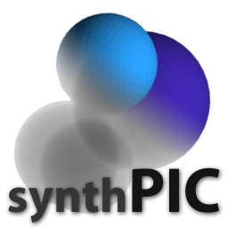

[](https://github.com/maxfrei750/synthPIC4Matlab/blob/master/LICENSE) 
[](https://github.com/maxfrei750/synthPIC4Python)
[](https://gitlab.com/maxfrei750/synthPIC4Python)



# synthPIC4Python
The *synthetic Particle Image Creator (synthPIC) for Python* is a toolbox to create synthetic training and benchmark data for image based particle analysis methods. As of now, it is in a very early stage of development. Therefore, there is currently very little documentation and every current feature might be subjected to heavy changes in the future.

In principle, synthPIC4Python is simply a set of scripts, .blend-files and concepts to control [Blender](https://www.blender.org/), to have it render large sets of randomized images, depicting large quantities of objects. There is no limitation concerning the shape of the objects, as they are controlled only by the so-called primitives in the .blend-files that the user supplies. However, it was created with the use for particle images in mind. Apart from the images themselves, synthPIC4Python also offers easy solutions to render instance masks, so that the resulting data can be used for the training of various segmentation and detection algorithms (e.g. Faster-RCNN, Mask-RCNN, etc.).


## Table of Contents
   * [SynthPIC4Python](#synthpic4python)
   * [Table of Contents](#table-of-contents)
   * [Workflow](#Workflow)
   * [Setup](#setup)
   * [Getting Started](#getting-started)
   * [Known Limitations](#known-limitations)


## Setup
The setup is very simple. Just run:
```
git clone https://github.com/maxfrei750/synthPIC4Python.git
cd synthPIC4Python
python setup_synthpic.py
```

The setup script then downloads a local copy of the appropriate blender version for your operating system and installs some requirements into Blender's custom python environment. The setup process does not impact other Blender installations on you machine.

## Workflow
When using synthPIC, we need to supply three types of resources:
1. A python script (see e.g. `./recipes/sopat_catalyst.py`), which holds a recipe to control how Blender should use the supplied primitives and what to render.
2. Exactly one .blend file (see e.g. `./scenes/sopat_catalyst.blend`) which holds information (e.g. camera position, lights, etc.) describing the scene, in which the primitives should be placed. These files can be created most comfortably in Blender.
3. One or more .blend files (see e.g. `./primitives/sopat_catalyst/dark.blend`), each of which must contain exactly one object called *primitive*. These primitives can be loaded into Blender via the recipe to be placed into the scene and rendered. These files can be created most comfortably in Blender.

To render images, a recipe and a scene file are passed to the script `render.py`:  
e.g. `python render.py --recipe ./recipes/sopat_catalyst.py --scene ./scenes/sopat_catalyst.blend` 

The rendering script then loads the supplied scene in Blender and executes the commands of the recipe, such as the loading, randomization and placement of primitives, in Blender's own custom python environment. 

## Getting started
A good starting point is the example recipe `./recipes/sopat_catalyst.py` with the accompanying scene file `./scenes/sopat_catalyst.blend` and the primitives `./primitives/sopat_catalyst/dark.blend` and `./primitives/sopat_catalyst/light.blend`. Run it by executing the following command:  
`python render.py --recipe ./recipes/sopat_catalyst.py --scene ./scenes/sopat_catalyst.blend` 
## Known limitations
* Only the rather slow cycles renderer works on headless servers at the moment. 
This also affects the rendering of masks, which uses the very quick Workbench renderer.
A possible solution would be the optional utilization of the cycles renderer for the rendering of masks.
